# Google-Cloud-Practice-Project
This is The repository for the GCP project

##  Create a streaming data pipeline for a real_time dashboard with cloud Dataflow
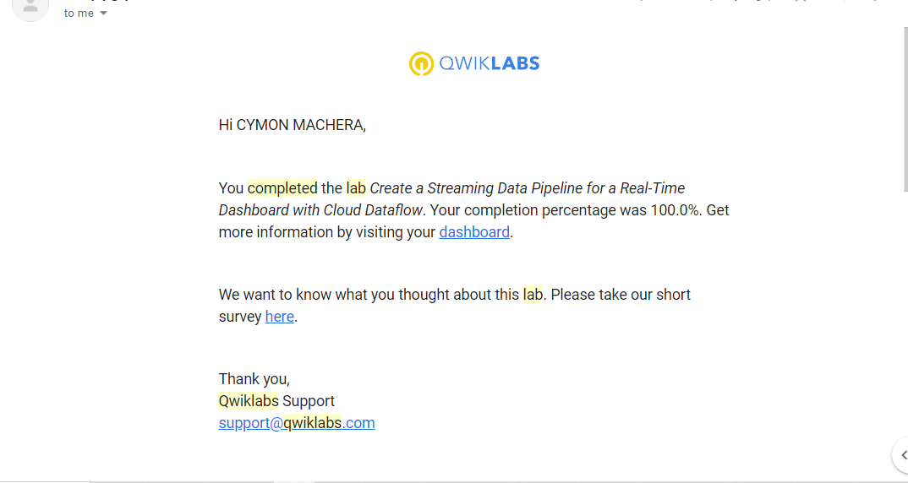
## Classify Image with Pre-built ML models using cloud Vision API and AutoML
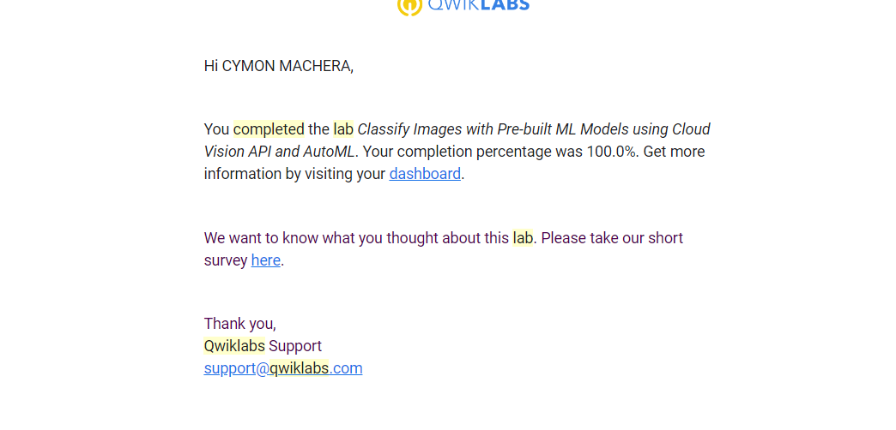
## Predict visitor Purchasing with a classification Model with BigQuery ML
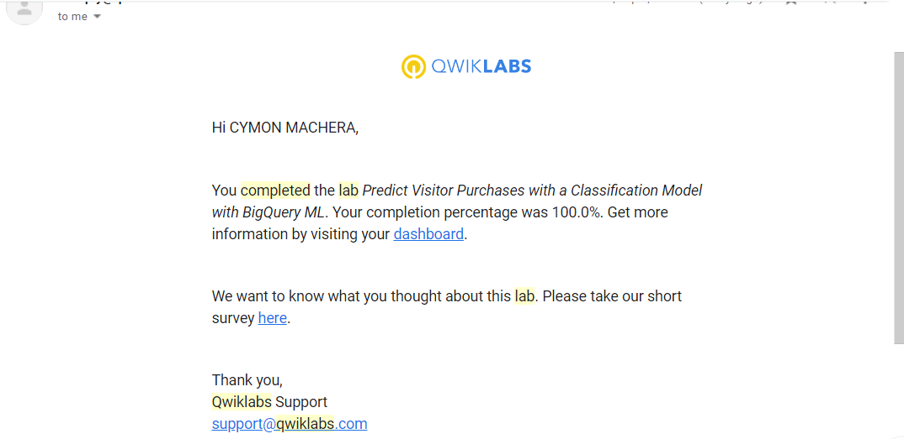
## Recommended Products  using ML with cloud SQL and DataProc
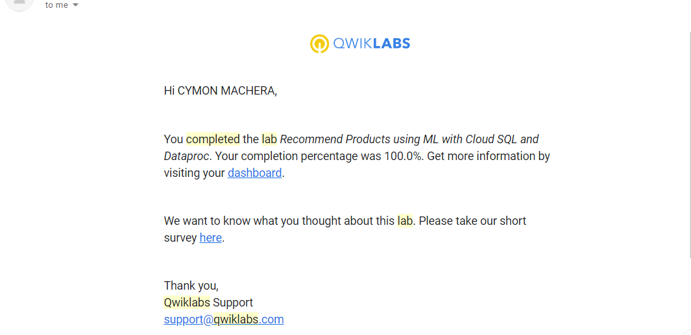
## Explore a BigQuery Public Dataset
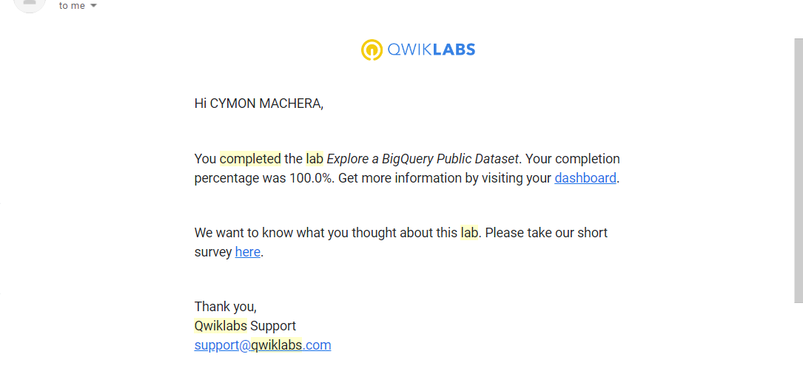
##Storing the image and video files in cloud starage v1.1
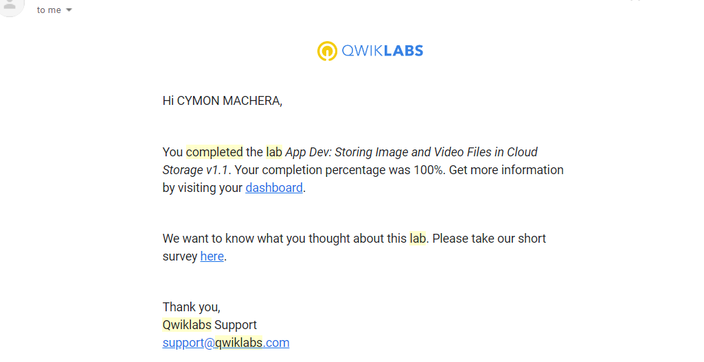
## Storing Application data in Datastore v1.1
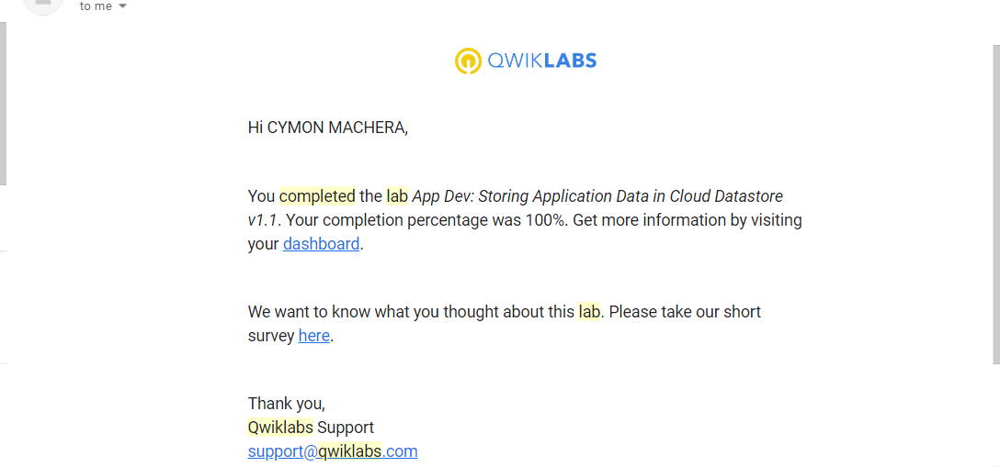
## Setting up a development Environmentv1.1
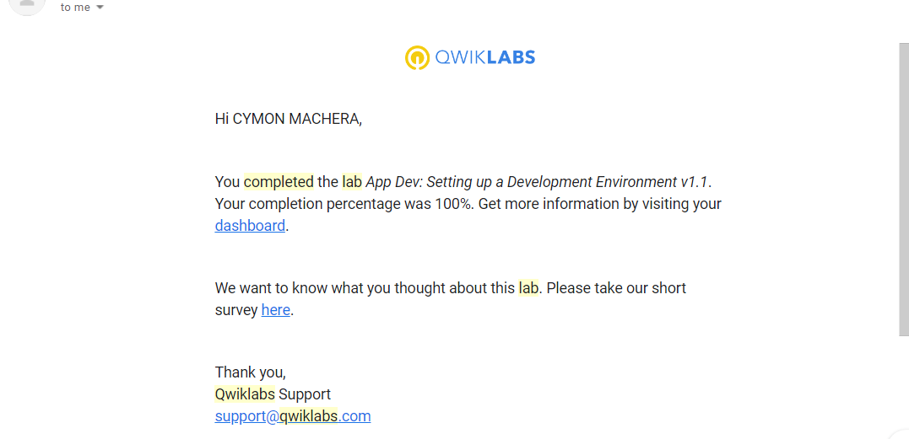
## Cloud IAM
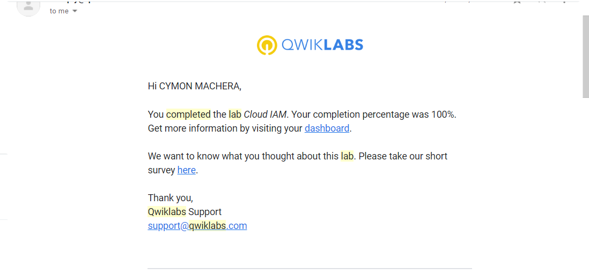
## Virtual Machine
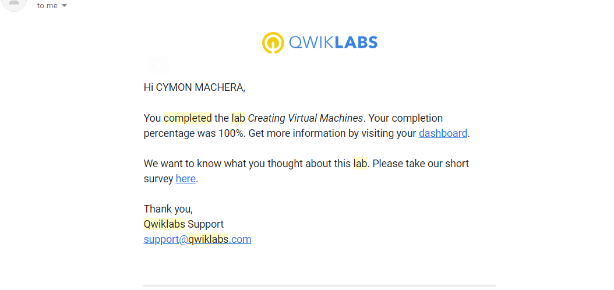
## Concole and Cloud Shell
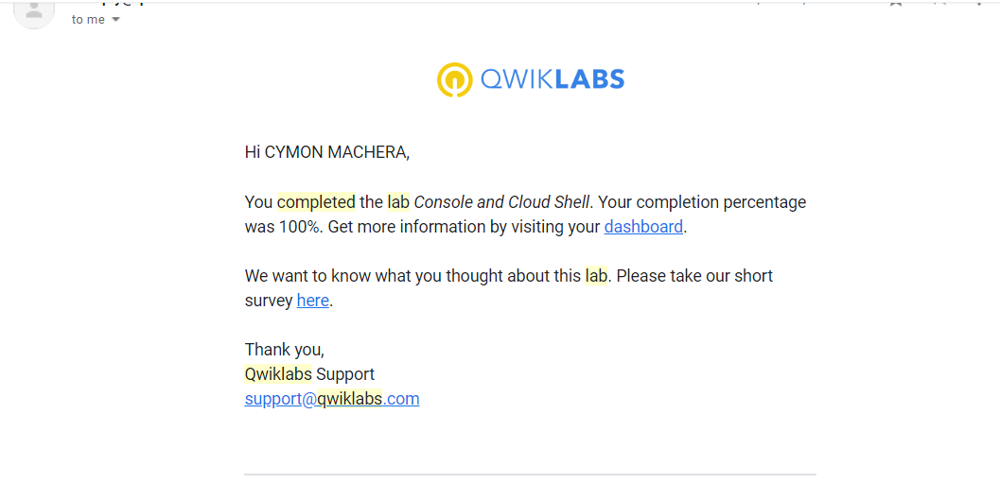
## Infrastructure Preview
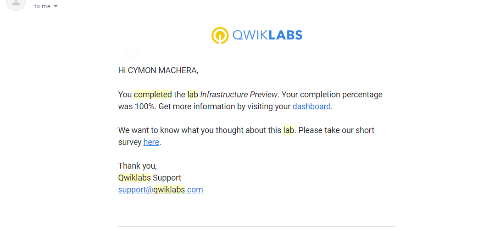

